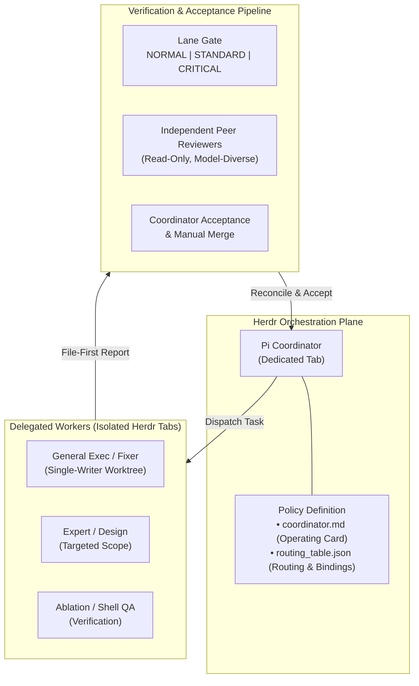
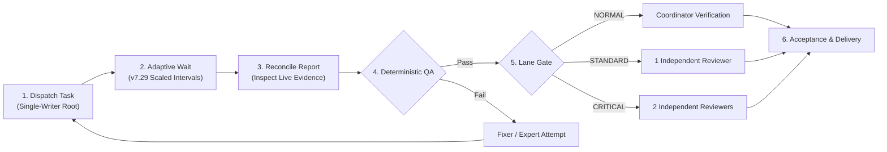
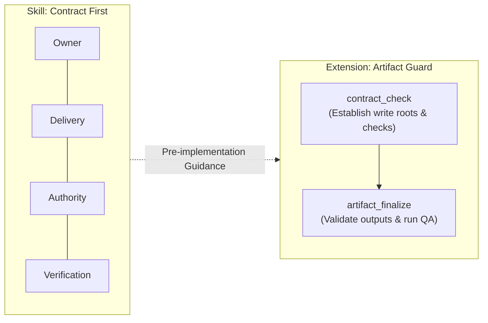

# Herdr + Pi Coordination Standard

> **Version:** `7.29-draft` &nbsp;|&nbsp; **Core Policy:** `coordinator.md` + `routing_table.json` &nbsp;|&nbsp; **Runtime:** Herdr (Orchestration) + Pi (Coordinator)

An operating standard for multi-agent software engineering. It pairs **Herdr** as the tab-based orchestration plane with **Pi** as the coordinator agent, providing deterministic verification gates, single-writer isolation, and structured handoffs across delegated AI coding tasks.

---

## System Architecture



---

## Core Policy Files

The standard is defined by two foundational files:

| File | Role | Responsibilities |
|---|---|---|
| [`coordinator.md`](coordinator.md) | **Operating Card** | Governs topology, single-writer roots, task lanes, [QA/review](coordinator.md#3-qa-and-review) gates, post-delivery ablation, and publication boundaries. |
| [`routing_table.json`](routing_table.json) | **Routing & Bindings** | Defines model bindings, aliases, effort profiles, child-session permissions, and [routing](coordinator.md#4-routing) triggers. |

### Highlights in v7.29
- **Adaptive Long-Wait Intervals**: For long-running, stable tasks, the coordinator dynamically scales check intervals (e.g., 5, 10, 15, or 30 minutes) using verified wake-up timers, significantly reducing redundant polling cycles while ensuring prompt intervention when milestones arrive. See [progress monitoring](coordinator.md#6-evidence-progress-and-handoff).
- **Self-Contained Operating Policy**: All active rules reside directly in `coordinator.md` and `routing_table.json`, with previous drafts preserved in `archive/` for historical reference.

---

## Coordinator Lifecycle & Lanes

### Workflow Lifecycle



### Lane Classification

Every task card is assigned exactly one lane based on risk and blast radius:

| Lane | Target Scope | Verification Gate |
|---|---|---|
| **NORMAL** | Routine, localized, easily reversible implementation and mechanical changes. | QA PASS + Coordinator direct verification. |
| **STANDARD** | Meaningful functional, behavioral, or architectural adjustments. | QA PASS + 1 fresh, independent formal reviewer. |
| **CRITICAL** | State migrations, security boundaries, protocols, or irreversible operations. | QA PASS + 2 fresh, independent formal reviewers (requires accepted binding plan). |

> **Structural Overlay**: When a task impacts component boundaries (`ARCHITECTURE`), permissions (`SECURITY_AUTHORITY`), cross-module contracts (`SCHEMA_PROTOCOL_CONTRACT`), or concurrency models, it is marked `structural: true`, requiring a formal binding plan and the **CRITICAL** lane gate.

---

## Quickstart

### 1. Initialize Coordinator
Place `coordinator.md` and `routing_table.json` in your working directory, open a dedicated Herdr Tab for Pi, and bootstrap the session:

```text
Read coordinator.md and routing_table.json as the coordinator workflow policy,
within the user's authorization and project constraints.
Declared version: 7.29-draft. Do not load archive/. Follow the card.
```

### 2. Operational Rules
1. **Dedicated Tabs**: Every major worker runs in its own visible Herdr Tab.
2. **Single-Writer Isolation**: Exactly one active writer per mutable working tree.
3. **File-First Evidence**: Workers record findings, commands, and output hashes in attempt-specific report files.
4. **Verified Completion**: Completion requires matching file evidence, passing QA, and required reviewer sign-offs.

---

## Auxiliary Components

The repository provides two optional tools to assist with pre-implementation alignment and runtime consistency:



### 1. Contract First (Pi Skill)
- **Path:** [`skills/contract-first/SKILL.md`](skills/contract-first/SKILL.md)
- **Install Target:** `~/.agents/skills/contract-first/SKILL.md`
- **Purpose:** Guides agents to establish four foundational pillars before altering code or deliverables:
  - **Owner**: Authoritative module or schema defining the interface.
  - **Delivery**: Expected outputs and invariants that must remain true.
  - **Authority**: Authorized scope and safe working boundaries.
  - **Verification**: Executable checks that demonstrate correctness.

### 2. Artifact Guard (Pi Extension)
- **Path:** [`extensions/artifact-guard/index.ts`](extensions/artifact-guard/index.ts)
- **Install Target:** `~/.pi/agent/extensions/artifact-guard/index.ts`
- **Purpose:** Enforces self-consistency within Pi sessions, catching accidental drift (e.g., unintended write paths or omitted verification runs).
- **Operating Modes**: Runs in `ADVISORY` mode by default, or `ENFORCE` mode when `.artifact-guard.json` is present in the workspace root.
- **Key Tools**:
  - `contract_check`: Registers authorized write roots, immutable inputs, required outputs, and QA command strings.
  - `artifact_finalize`: Verifies declared outputs and executes designated QA commands.

---

## Verification & Tests

Run the regression test suite for Artifact Guard using Node.js 22.18+ (zero external dependencies):

```sh
node tests/artifact-guard.test.mjs
```

The test runner validates 31 test cases and 4 ablation variants using isolated temporary fixtures, verifying contract tracking, path containment, lease markers, and finalization workflows.
