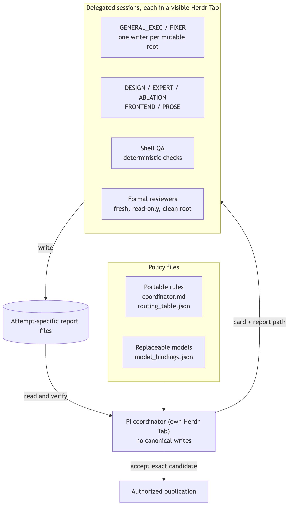
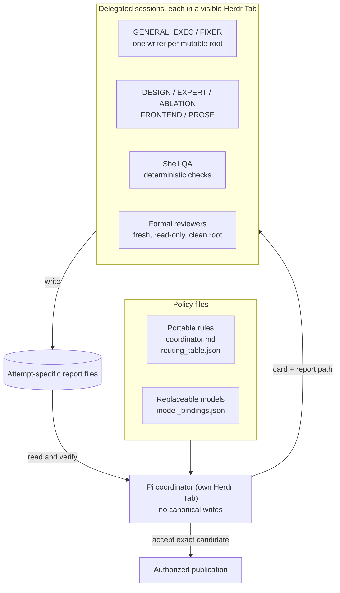
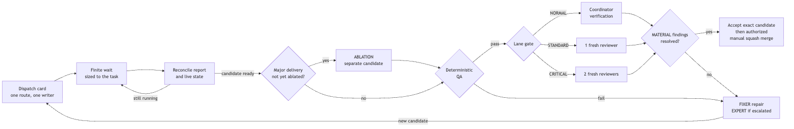
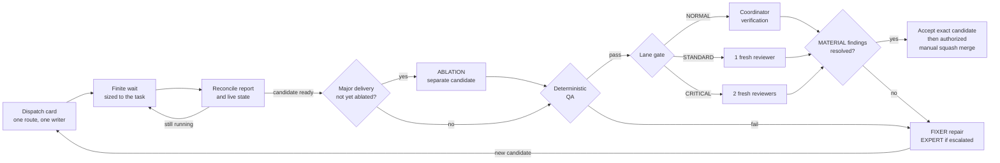
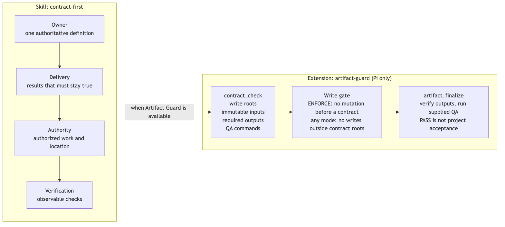
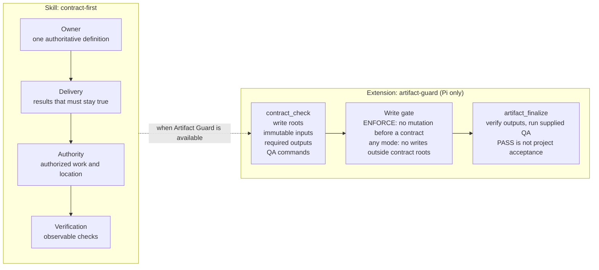

# Herdr + Pi Coordination Standard

**Version `8.0`**

A working standard for running several AI coding agents on one project. **Herdr** hosts every session in its own terminal Tab, and **Pi** acts as the coordinator: it hands out tasks, reads the workers' reports, and decides what gets accepted. The coordinator does not write the code itself.

The policy lives in three files, and only these three:

| File | What it holds | Share it? |
|---|---|---|
| [`coordinator.md`](coordinator.md) | The operating card: who may write where, how risky work is reviewed, how reports are handed back, and when work may be merged or published | Yes, portable |
| [`routing_table.json`](routing_table.json) | The roles (routes), when each one is used, which review seats each lane needs, the merge gate, and the fixed prompts. No model names | Yes, portable |
| [`model_bindings.json`](model_bindings.json) | Your subscriptions, and which model, harness, and reasoning effort each role uses right now | Personal; replace with your own |

When a new model comes out, only `model_bindings.json` changes. To give the standard to someone else, send the first two files and let them write their own bindings.

This README and its diagrams only explain those files. If they ever disagree, the policy files win.

## How it fits together



<details>
<summary>Mermaid source</summary>



</details>

Each delegated task gets a card naming one route and its own report file, and any directory being changed has exactly one writer at a time. The coordinator waits, reads the report, checks the actual output, and only then moves on.



<details>
<summary>Mermaid source</summary>



</details>

## Lanes

Every card gets one lane, based on what a mistake would cost:

| Lane | Typical work | What it takes to accept |
|---|---|---|
| NORMAL | Routine, local, easily reversed changes | QA passes and the coordinator checks the output |
| STANDARD | Important behavior or correctness changes | QA passes plus one fresh, independent reviewer |
| CRITICAL | Mistakes that could corrupt state, cross a trust boundary, or can't be undone | QA passes plus two fresh, independent reviewers |

Some work is also marked **structural**, such as project-defining architecture, security boundaries, or shared contracts. Structural work needs an accepted binding plan first and then the CRITICAL gate. The exact criteria are in [section 2 of the card](coordinator.md#2-lanes-and-gates).

## Getting started

Open a Herdr Tab for Pi and point it at the three policy files where they are. Don't copy them, so there is only ever one live version:

```text
Read <standard-dir>/coordinator.md, <standard-dir>/routing_table.json, and
<standard-dir>/model_bindings.json as the coordinator workflow policy, within
the user's authorization and project constraints.
Declared version: 8.0. Do not load archive/. Follow the card.
```

## Recent changes

- **8.0:** Model choices moved out of the rules into `model_bindings.json`, so the card and routing table no longer name any model or vendor. New bindings: ordinary execution and repairs use the latest Opus at high effort in Claude Code; design, expert escalation, and ablation try the latest Fable at max first, then the latest GPT at xhigh; the review seat uses the latest GPT Astra at high; the CRITICAL audit seat uses the latest Gemini at High. Cursor and Grok are no longer used, and there is currently no replacement model: if a route's model can't run, even through Pi, the task stops and records what would unblock it.
- **7.29:** When long-running work shows no change, the coordinator may wait longer between checks (for example 5, 10, 15, or 30 minutes) instead of waking up every couple of minutes. It still reads the reports and checks live state after every wait. See [section 6](coordinator.md#6-evidence-progress-and-handoff).

## Optional tools



<details>
<summary>Mermaid source</summary>



</details>

**Contract First** ([`skills/contract-first/SKILL.md`](skills/contract-first/SKILL.md), installed to `~/.agents/skills/contract-first/SKILL.md`) is a short skill. Before changing code or a deliverable, the agent pins down four things: who owns the interface, what must stay true, what it's allowed to do and where, and which checks prove it worked.

**Artifact Guard** ([`extensions/artifact-guard/index.ts`](extensions/artifact-guard/index.ts), installed to `~/.pi/agent/extensions/artifact-guard/index.ts`) is a Pi extension that catches accidental drift, such as writing to the wrong directory or skipping QA. It is a tripwire, not a sandbox.

- `contract_check` records the allowed write roots, frozen inputs, required outputs, and QA commands.
- `artifact_finalize` checks the outputs and runs the QA commands you pass it. Its PASS is not project acceptance.
- If a `.artifact-guard.json` file exists in the current directory or any parent up to the repository root, the guard runs in ENFORCE mode and blocks edits until a contract exists. Otherwise it runs in ADVISORY mode. In both modes, once a contract exists, writes outside its roots are blocked.

## Tests

The Artifact Guard tests need Node.js 22.18 or later and no other dependencies:

```sh
node tests/artifact-guard.test.mjs
```

They run 31 checks against temporary fixtures, then rerun them 4 more times, each with one part of the guard removed, and check that the results change exactly as expected.
